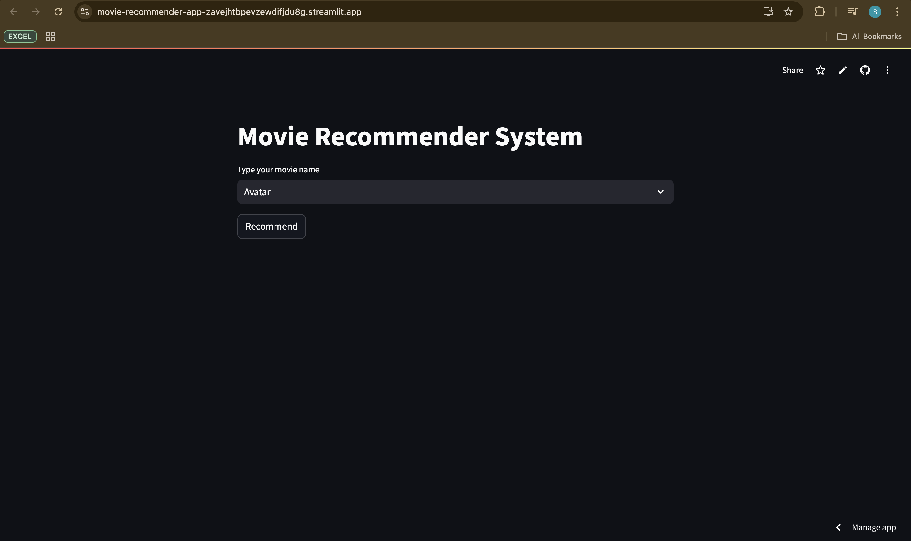
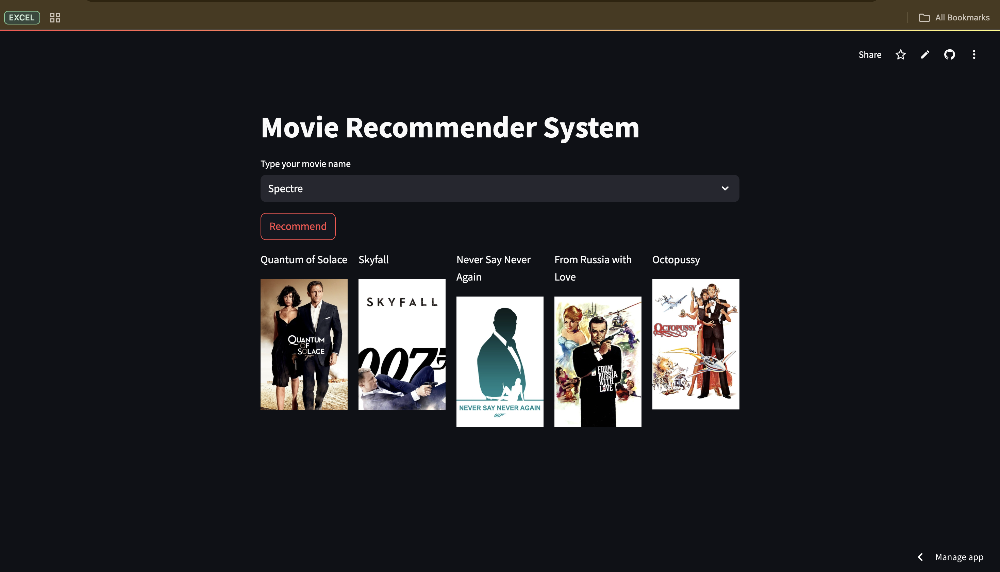

# Movie Recommender App

A machine learning-based web application that suggests personalized movie recommendations based on user preferences. Built using content-based filtering techniques and cosine similarity.

## Features
- Recommends movies from a database of 5000 tmdb movies.
- Provides suggestions based on a favorite movie.
- User-friendly interface with a clean, responsive design.

## Technologies Used
- **Python** for backend logic.
- **Pandas** and **NumPy** for data processing.
- **Scikit-learn** for collaborative filtering algorithms.
- **Streamlit** for the web app development.
- **HTML/CSS** for front-end design.

## Screenshots



## Streamlit App Link
You can directly access and interact with the Movie Recommender App from the following link:
[Movie Recommender App on Streamlit Sharing](https://movie-recommender-app-zavejhtbpevzewdifjdu8g.streamlit.app/)

## Installation

1. Clone the repository:
    ```bash
    git clone https://github.com/your-username/movie-recommender-app.git
    ```
2. Navigate to the project directory:
    ```bash
    cd movie-recommender-app
    ```
3. Install the necessary dependencies:
    ```bash
    pip install -r requirements.txt
    ```
4. Run the Streamlit app locally:
    ```bash
    streamlit run app.py
    ```
5. Open your browser and go to `http://localhost:8501` to use the app.

## How it Works

The Movie Recommender App uses content-based filtering to recommend movies. You can input a favorite movie, and the app will suggest movies with similar attributes.

## Future Improvements
- Add user login and rating submission functionality.
- Integrate real-time movie data from APIs like TMDb.

## Contact
For questions or collaboration, contact me at [m2024anlt026@stud.tiss.ac.in].
